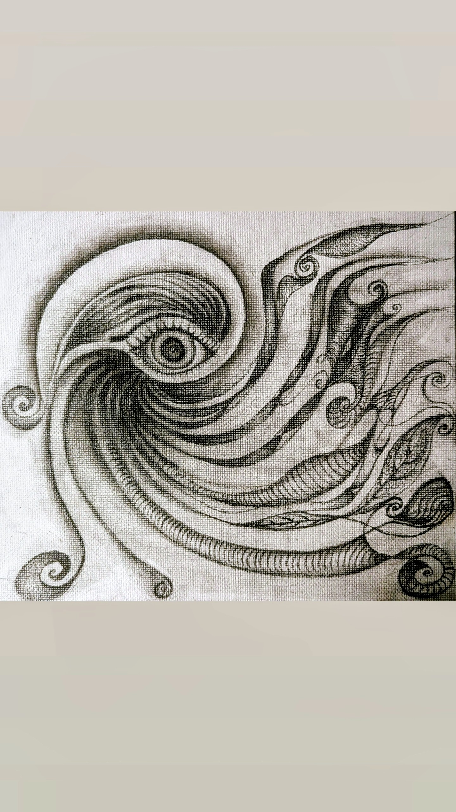
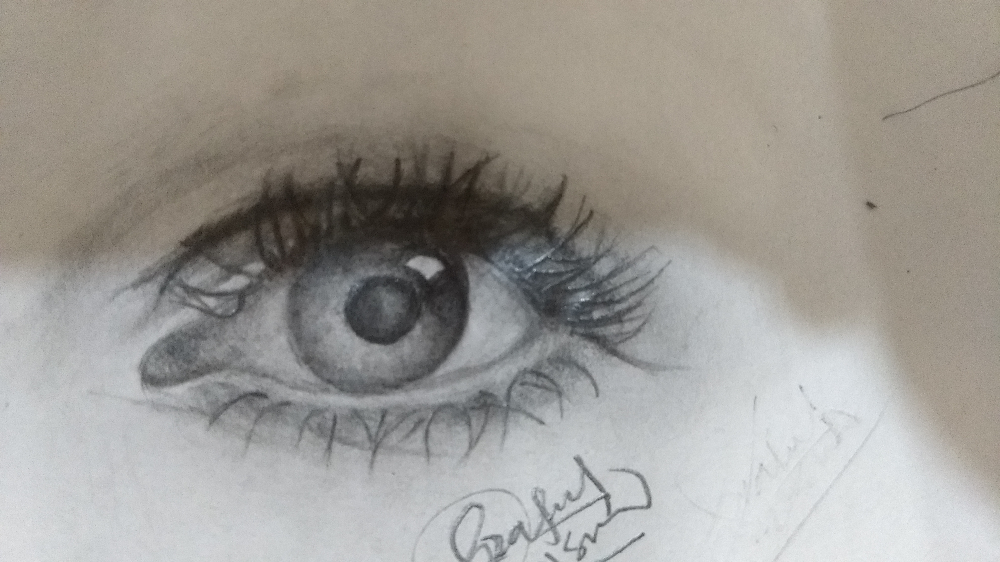
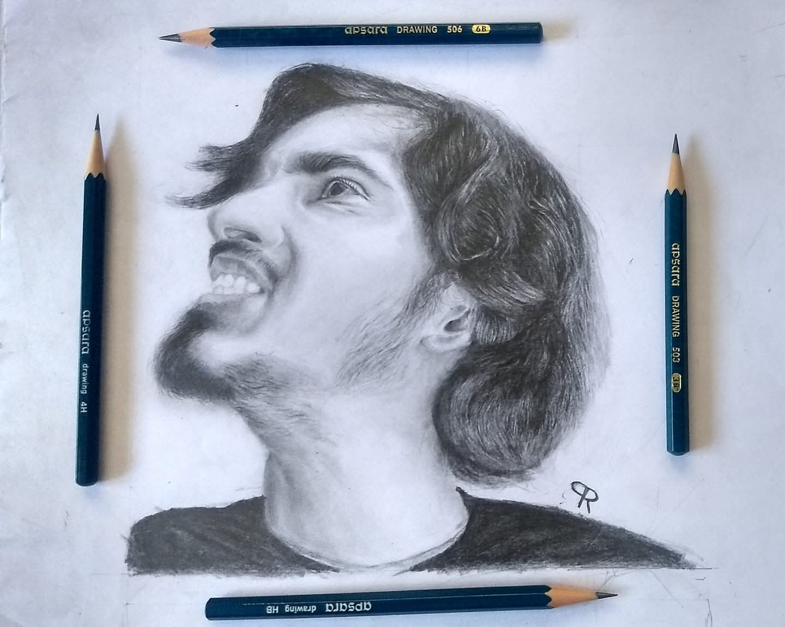
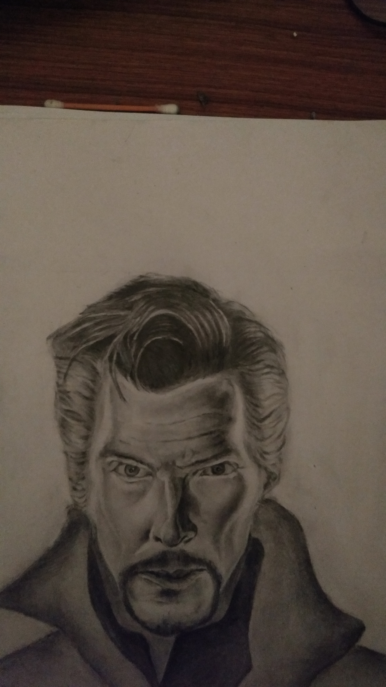
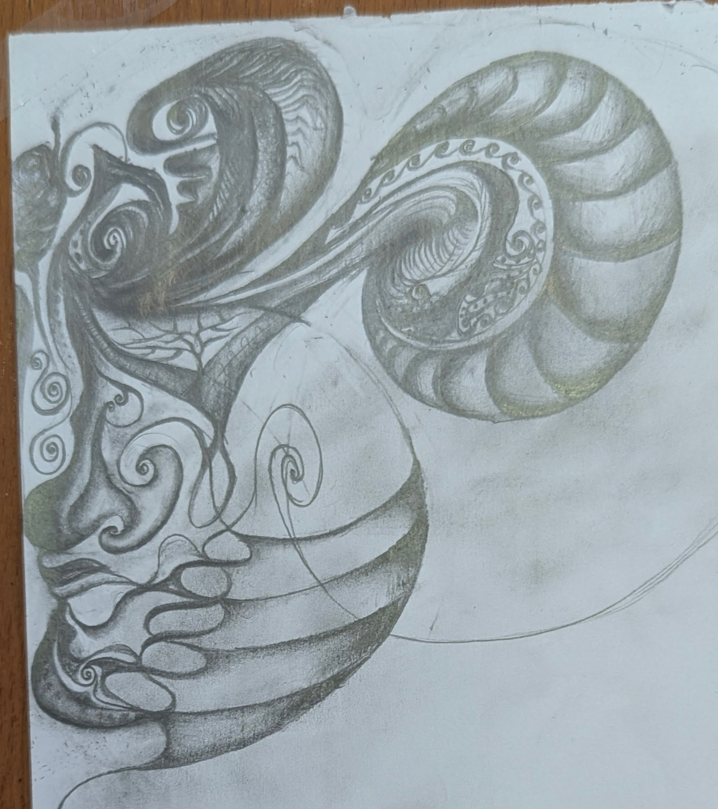
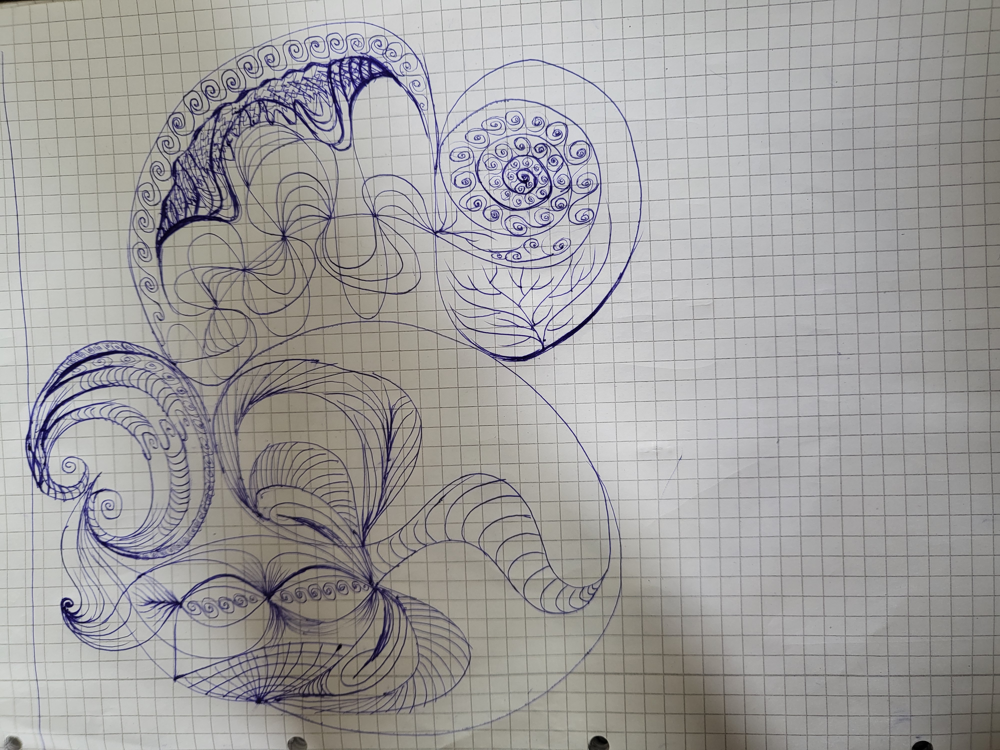
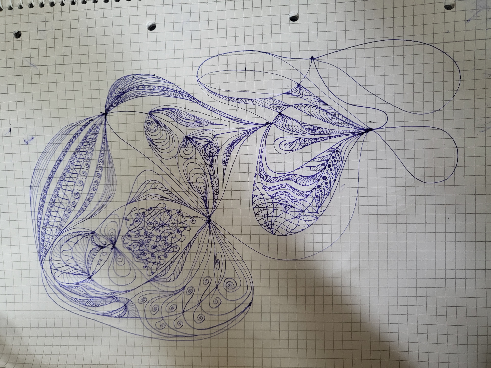

<!DOCTYPE html>
<html lang="en">
<head>
  <meta charset="UTF-8">
  <meta name="viewport" content="width=device-width, initial-scale=1.0">
  <title>Journal & Creative - Praful Rahangdale</title>
  <link rel="stylesheet" href="style.css">
</head>
<body>

  

    <a href="index.html">Home</a>
    <a href="publications.html">Publications</a>
    <a href="talks.html">Talks & Conferences</a>
    <a href="creative.html" class="active-nav-link">Journal</a>
  

  

    
    

      <h1 style="font-size: 2.5em; margin-bottom: 15px;">Journal & Curiosities</h1>
      

      
  Outside of mathematics, I am deeply attracted to art, music, and nature. My leisure time is usually spent drawing sketches and patterns, practicing yoga and meditation, and taking part in sports such as table tennis, kickboxing, and bouldering. Recently, I have also started writing poems to give shape to my wandering thoughts :). This space is a collection of those parallel pursuits.
      
      

    

    

      <h2 style="border-bottom: 1px solid #eee; padding-bottom: 10px; margin-bottom: 20px;">I. Sketches</h2>
      

        

        

        

        

        

        

        

        

      

    

      <h2 style="border-bottom: 1px solid #eee; padding-bottom: 10px; margin-bottom: 20px;">II. Writings</h2>
      
      

        <h3 style="margin-top: 0; color: #3E4A41; font-size: 1.4em;">A Gift</h3>
        
 
On a tree by my window,
lives a baby bird, tender and tiny,
from branch to branch she hops,
testing each until she finds
the one that touches the neighbor tree.

Her little wings, her soft tiny feet,
her silly swirling head- gone in a blink.
Unaware, she wants to claim her world
as quickly as she can.

One rainy day comes a wild wind,
the touch, the force—too strong
for her slight body.
She braces, trusts the bond
of her fragile feet and swaying branches.
But the gust is stronger
than her faith, stronger than her feet.
In that brief moment of complete chaos,
fear
and surrender—
her wings
could fly.
Farther than she could  imagine,
away from her home, her world.

From the fear of falling,
of losing trust in those feet,
to the sudden sense of wings—
the breath, the bliss,
the freedom of the first flight.
She found the precious gift.

I wonder how long she'll remember this ecstasy.
Now, not even in my dreams,
not through drugs or rituals,
can I feel the joy,
the way it was
the first time.

Oh, how it was—
the gift of childhood,
the gift of becoming,
the gift of consciousness
        

        
      

      
      

  

</body>
</html>
